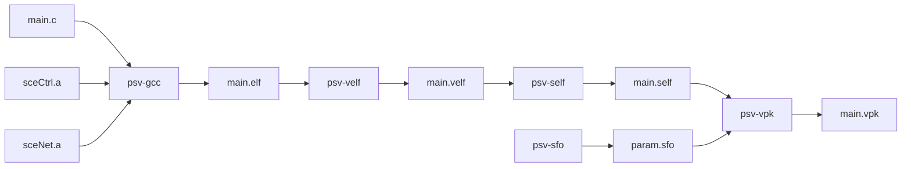

[](https://github.com/psvsdk/psvsdk)

Stable, Consistent and Self-Documented SDK for the PSVita.

## Install

If you don't need a specific psvsdk version, you can easily [build and install](#manual-build--install) it. However, new PSVita APIs are discovered/updated [everyday](https://github.com/vitasdk/vita-headers/commits/master). To get a reproducible build, one shall use a versioned docker image : `docker run -rm -it psvsdk/psvsdk make`

## Usage

The psvsdk provides a set of tools to compile your C sources into a PSVita compatible binary using the following workflow:



- Compile `main.c` into an ARM ELF using [psv-gcc](docs/psv-gcc.1.md) which is `arm-none-eabi-gcc` with extra flags.
- Convert this ARM ELF into a [Vita ELF](docs/velf.5.md) using [psv-velf](docs/psv-velf.1.md).
- Sign this [`.velf`](docs/velf.5.md) using [psv-self](docs/psv-self.1.md) into a signed Elf [`.self`](docs/self.5.md).
- Create an SFO file using [psv-sfo](docs/psv-sfo.1.md) to describe your application to the LiveArea (title, version, parental, ...).
- Bundle both [`.self`](docs/self.5.md) and [`.sfo`](docs/sfo.5.md) into a [`.vpk`](docs/vpk.5.md) VitaPacKage using [psv-vpk](docs/psv-vpk.1.md).

Example:

```sh
psv-gcc  main.c -o a.elf
psv-velf a.elf  a.velf
psv-self a.velf a.self
psv-sfo  TITLE="Hello World" ... > a.sfo
psv-vpk  a.self:EBOOT.bin a.sfo:sce_sys/param.sfo > a.vpk
#curl -T a.vpk ftp://$IP:1337/ux0:/
```

We can generify them in a Makefile:

```makefile
%.elf : %.c         ; psv-gcc  $^ -o $@
%.velf: %.elf       ; psv-velf $^ $@
%.self: %.velf      ; psv-self $^ $@
%.sfo : %.ini       ; psv-sfo  $(shell cat $^) > $@
%.vpk : %.sfo %.self; psv-vpk  $(word 1,$^):sce_sys/param.sfo $(word 2,$^):eboot.bin > $@
```

## Build & Install

> Note: You'll need the `build-essential` and `gcc-arm` packages to build the psvsdk

- Build the toolchain using `make`. (see [Makefile](Makefile) for possible options)
- Install globally (require sudo): `sudo make install`
- Install locally (only for you): `OUT_DIR=$HOME/.local/bin MAN_DIR=/tmp make install`
- Build locally a Docker image: `docker build -t psvsdk/psvsdk:latest .`

Feel free to take a look at the [.travis.yml](.travis.yml) or the [Dockerfile](Dockerfile) to see how the prebuild SDK is made.

## Naming

- ELF: Executable Locatable File.
- Module : An ELF file that exports/provides 1-N libraries and imports/requires 0-N libraries.
- Library : A set of functions related to a common topic (Ctrl,Io,Thread ...).
- NameID (NID): 32-bit hash generated from a salted {module, library, symbol} name.
- VELF: Generic ARM ELF with Vita-specific sections `.sceModuleInfo.rodata` and Import/Export definitions.
- SELF: Signed VELF
- FSELF: Signed VELF but with an empty (0000...) signature.
- Stub: Piece of code that feign a function, so the code can compile, but in real life, this function will only be available at runtime.


